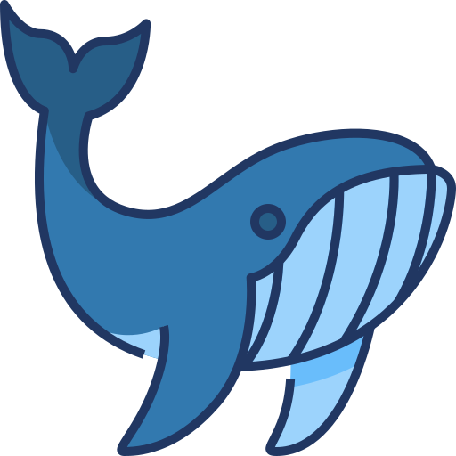

# Nama Proyek

<!-- Deskripsi singkat proyek Anda di sini. -->

## Penjelasan Singkat

<!-- **Nama Proyek** adalah sebuah aplikasi yang [deskripsi aplikasi, misalnya: membantu pengguna untuk mengelola tugas harian mereka dengan lebih efektif]. Aplikasi ini dibangun menggunakan [teknologi yang digunakan, misalnya: Python dan Django] dan dirancang untuk [tujuan aplikasi, misalnya: meningkatkan produktivitas dan pengelolaan waktu]. -->

## Fitur

<!-- - **Fitur 1:** Deskripsi singkat fitur pertama.
- **Fitur 2:** Deskripsi singkat fitur kedua.
- **Fitur 3:** Deskripsi singkat fitur ketiga.
- **Fitur 4:** Deskripsi singkat fitur keempat. -->

## Dokumentasi

<!-- Berikut adalah beberapa tangkapan layar dari aplikasi: -->

### Beranda

<!--  -->

### Halaman Tugas

<!--  -->

### Halaman Detail Tugas

<!--  -->

### Halaman Tambah Tugas

<!--  -->
